Nama: Ricky Putra Pratama Tedjo \
Kelas: TI-3C / 22

# Praktikum 1
## Langkah 1
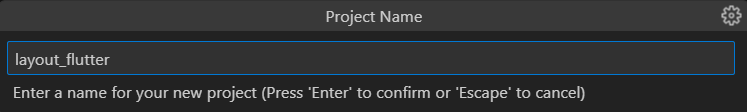

## Langkah 2
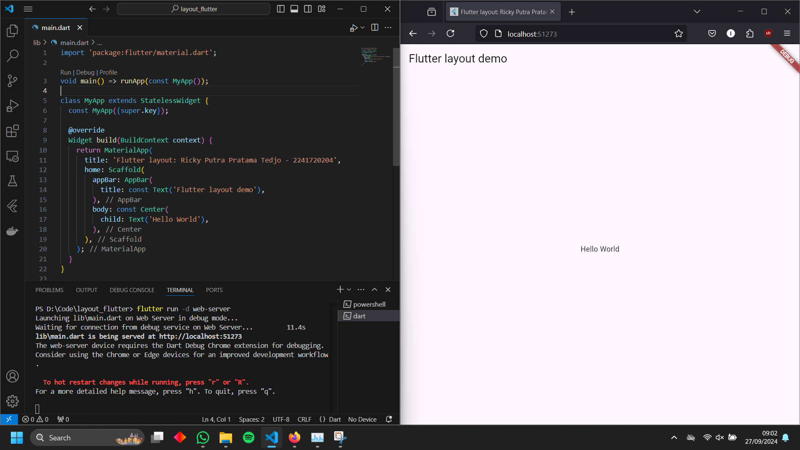

## Langkah 4
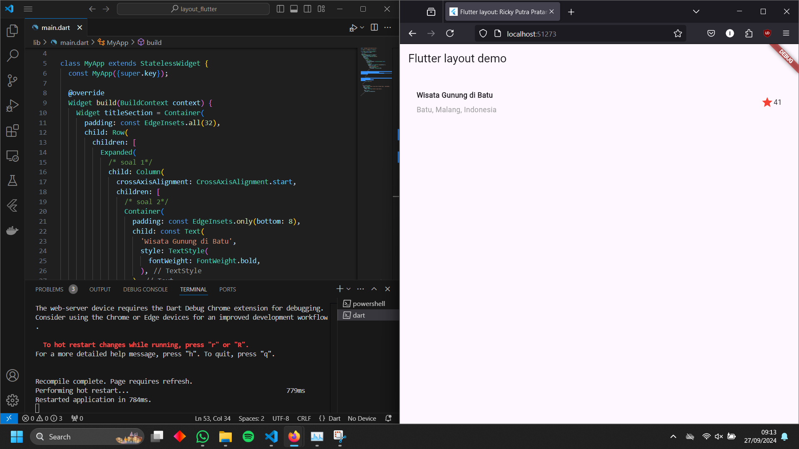

# Praktikum 2
## Langkah 1
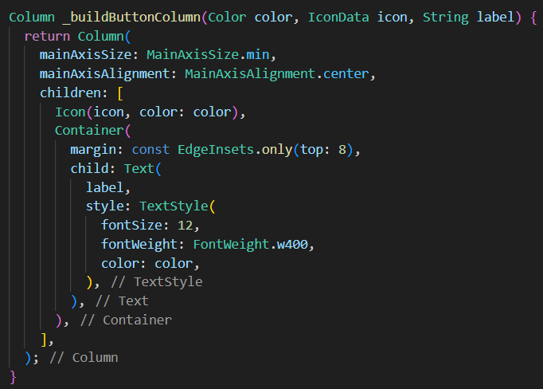

## Langkah 2
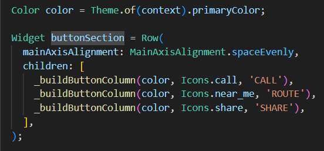

## Langkah 3
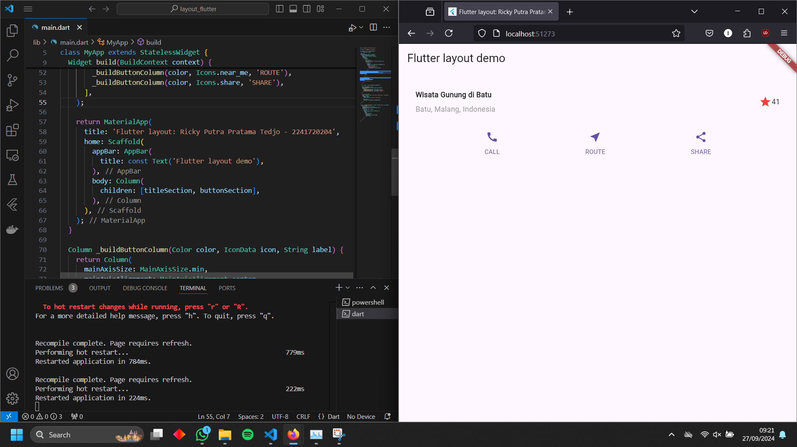

# Praktikum 3
## Langkah 1
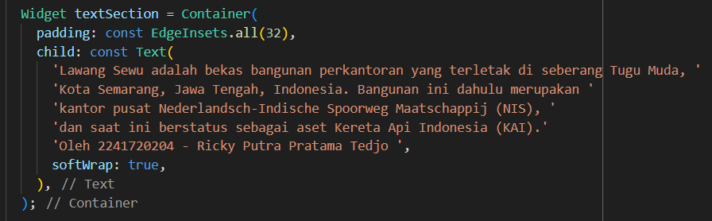

## Langkah 2
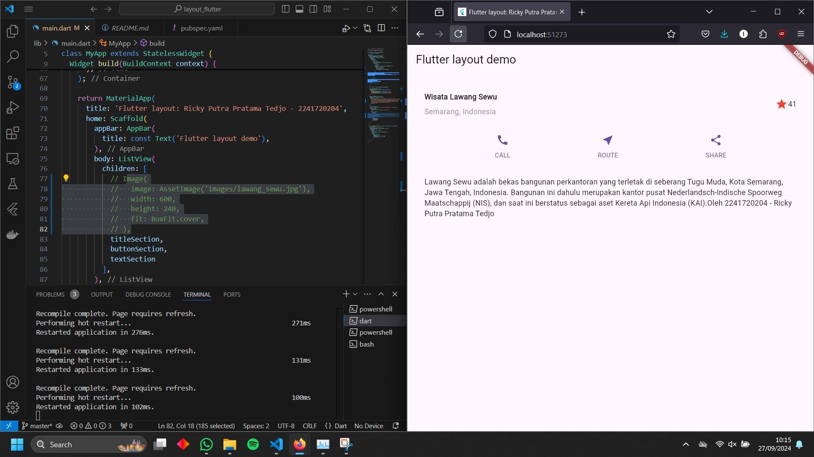

# Praktikum 4
## Langkah 1
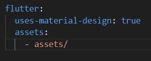

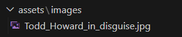

## Langkah 2
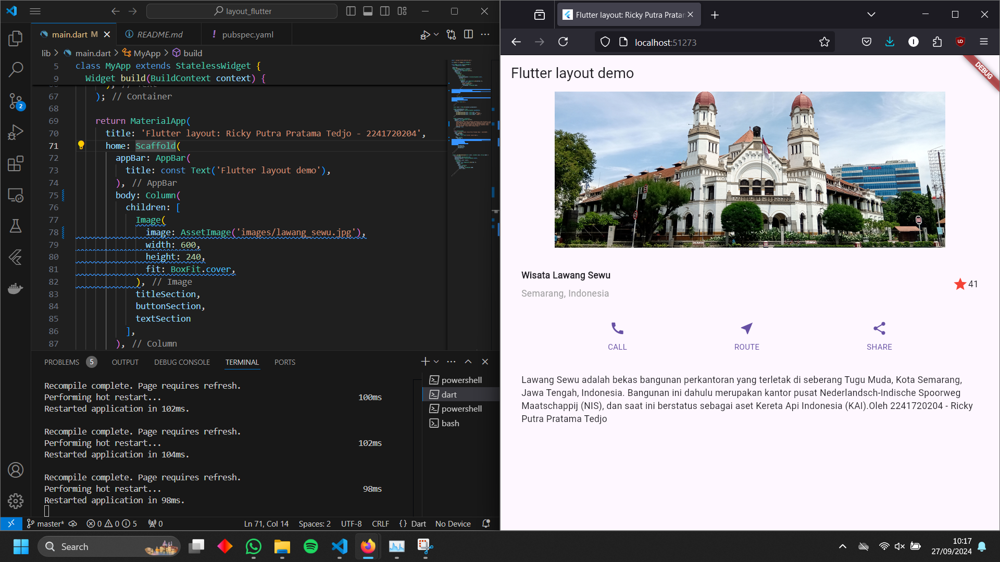

## Langkah 3
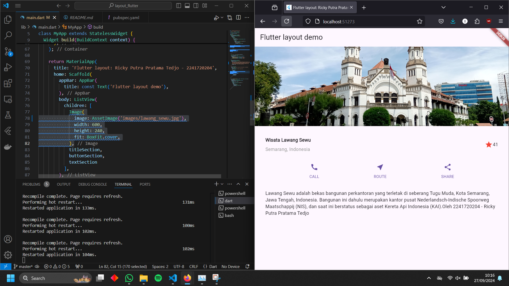
